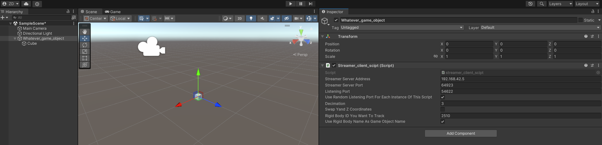
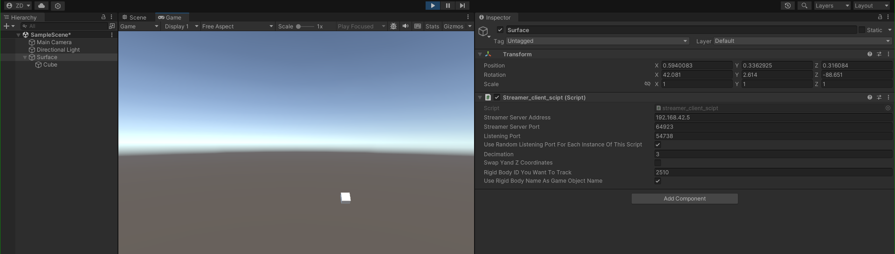

# Unity plug-in

This is a script that fetches and processes the data coming in from the data streamer. It is only using built-in libraries, so it should be reasonably platform-independent.

## How to add this in Unity

Create an empty game object. Add the mesh or whatever you want to be tracked, add this script, and then adjust the script as needed. You will want something like this:

* whatever-game-object
  * Whatever mesh
  * `streamer_client_script

So it should look like this:

### Configuration

At the very least, you need to know where the data streamer application runs, and what is the rigid body ID that is to be tracked. There are a number of options to be set, in particular:

* Streamer Server Address (`string`)
This is the IP address where your streamer application is. By default, this is set to `192.168.42.5`, because that is the computer this thing is running in the lab.
* Streamer Server Port (`uint16`)
No immediate need to change this, because this is hard-coded to 64923 on the server. Some routers have NAT on the LAN side, so if there are any subtleties in your network, feel free to change this.
* Listening Port (`uint16`)
Ideally, each instance this script should have its own port. If possible, try to avoid receiving multiple rigid bodies on the same port. It will work, but it makes the code more prone to crash due to buffer overflow.
* Use Random Listening Port for Each Instance Of This Script (`bool`)
If this is set to `true` by clicking the check box, the listening port number can be anything between what you specified in the option above, plus 200. Just a convenience thing, because I was too lazy to think.
* Decimation (`int`)
**IMPORTANT!** This tells the streaming server how many packets to blast at you every second. **You need to know the frame rate of your motion tracker set-up, and the frame rate with which you render in your application.** For example, if Motive runs on 200 Hz, but you only display at 60 Hz, set the decimation to (200/60 = 3.333) 3, which is the nearest integer to the result of your division.
  * If your decimation is too low, the script may hang your render loop
  * If your decimation is too high, the buffer may fill up, which will lead to increased lag and crashes.
* Swap Y and Z Coordinates (`bool`)
This is here due to clashing standards. Some motion tracker set-ups have the Z axis up, others have the Y axis up. You can change this in Motive settings as well for streaming, but you can do it here too.
* Rigid Body ID You Want To Track (`uint16`)
This is the rigid body ID in Motive. **Rigid Body ID 0 is reserved for the origin marker.** You can use any number between 1 and 65535. If the rigid body you specified here is not present in Motive, it will return a bunch of NaNs as coordinates and rotations.
* Use Rigid Body Name As Game Object Name (`bool`)
Check this if you want to rename the parent game object to the rigid body name in Motive. This is a convenience thing, and can help with development. Once your code stops, the game object name will be restored to whatever you set it in the first place. If you change the rigid body name while streaming, this will update in the next available frame when the game object is being enabled or the application started.

## Example

Motive runs on `192.168.42.5`, and I want to stream rigid body ID `2510` that is called `Surface` to some random port between `54622` and `54822`. In Unity, I wanted to move a cube (scaled down to `0.1, 0.1, 0.1`). So I created `Whatever_game_object`, put the cube as its child, scaled it, and set the script up from Unity GUI as above. When the script runs, it renamed my parent game object to `Surface'. See screenshot below.

You can see that the object position and rotation is updated real-time, as the packets come in.

## How does it work?

The GUI options are the publicly accessible global variables. Unity parses them and capitalises everything. In addition, the random number generator and and the `UdpCLient()` object.

* In `void Start()`:
  * The 'culture variables' are being set to `"en-US"`, so the decimal point will stay a decimal point no matter what the local settings are.
  * The local receiver port is randomised, if set from the GUI.
  * Following some string bashing, it sends the request packet to the server.

* In `void Update()`:
  * The code prepares the buffer into which the packet will be forwarded
  * **WAITS FOR A PACKET TO COME IN WHILE POTENTIALLY BLOCKING EVERYTHING ELSE**
  * Separates the string-ified packet from the server by field.
    * Does some sanity checks on the string, to make sure we have stuff to process.
  * With some more string bashing, it separates the coordinates and the quaternions
  * If need to, it will update the parent game object's name
  * Finally, it updates the coordinates and quaternion
    * ...and swaps Y and Z as required.

* In `void OnDestroy()` (also in `void OnApplicationQuite()`):
  * It sends a packet with the same port configuration, but sets the decimation to 0. This will tell the server to stop sending packets.